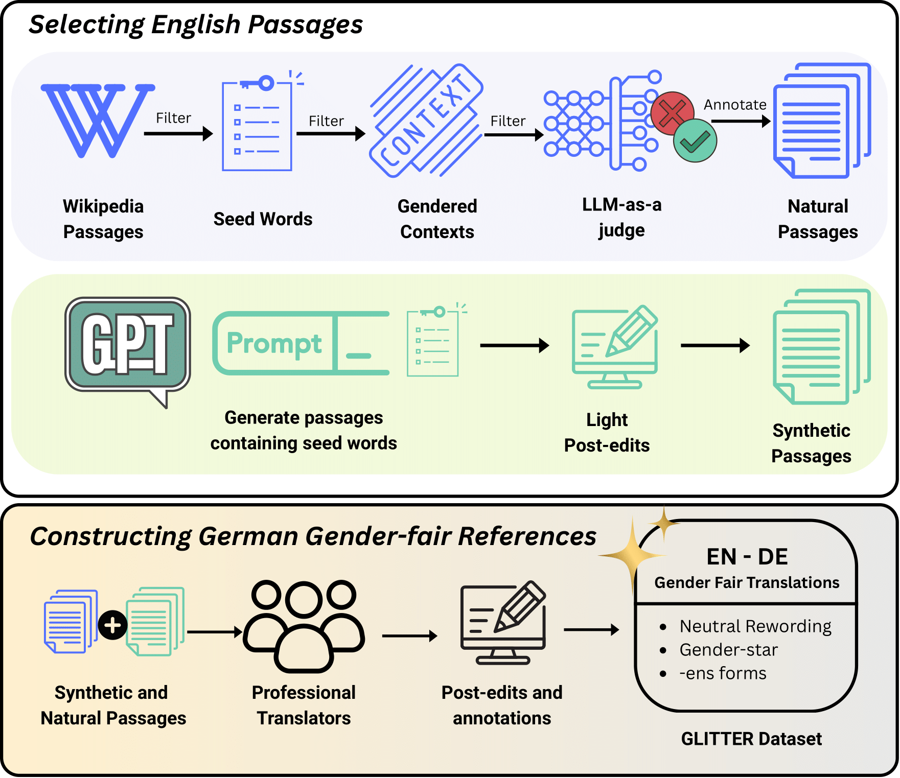

# GLITTER: A Multi-Sentence, Multi-Reference Benchmark for Gender-Fair German Machine Translation



GLITTER (Gender-Fair Language in German Machine Translation) is a comprehensive benchmark designed to evaluate machine translation systems' ability to produce gender-fair German translations from English sources. This repository provides the complete dataset, code for dataset construction, and experimental setups for gender-fair translation prompting.

## 📊 Dataset Overview

GLITTER addresses key limitations in existing gender-fair translation benchmarks by providing:
- **Extended context**: Four-sentence passages (vs. single sentences in existing benchmarks)
- **Multiple reference translations**: Three gender-fair alternatives per source
- **Diverse scenarios**: Both ambiguous and unambiguous gender contexts
- **Professional curation**: All references professionally translated and post-edited

### Dataset Statistics
- **Total pairs**: 2,010 English-German parallel pairs
- **Unique English sources**: 980
- **Reference types**: 565 neutral rewordings, 562 gender-star (*) forms, 545 ens-forms
- **Source types**: 567 natural (Wikipedia), 430 synthetic (GPT-4o generated)
- **Context diversity**: Ambiguous (505), unambiguous male (219), female (189), all genders (87)
- **Special content**: 112 instances with LGBTQ+ topics

## 📁 Repository Structure

### Core Files
- **`dataset.parquet`** - The complete GLITTER dataset in Apache Parquet format (2.0MB)
- **`card.md`** - Comprehensive dataset card with detailed metadata, structure, and methodology
- **`glitter.png`** - Visual representation of the GLITTER process and methodology
- **`LICENSE`** - Creative Commons Attribution 4.0 International license

### Dataset Construction (`dataset_construction/`)
Utilities and scripts used to construct the GLITTER dataset from Wikipedia and synthetic sources.

**Scripts:**
- **`1_filter_wikipedia.py`** - Extracts and filters passages containing seed terms from Wikipedia using BERT attention mechanisms
- **`1.2_label_with_model.py`** - Pre-annotates passages with ambiguity labels using SpaCy POS tagging
- **`2_analyze_dataset.py`** - Analyzes gender correlations, attention patterns, and generates statistics for dataset balancing
- **`3_sampling.py`** - Samples final dataset ensuring balance across categories (ambiguous, unambiguous, gender types) and uniform seed word distribution
- **`critic_gender-form.py`** - LLM-based evaluation script for analyzing gender forms used in translations
- **`translate.py`** - Translation utilities for processing passages with MT systems
- **`utils.py`** - Common utility functions for data processing and analysis

**Configuration:**
- **`config/gender_detection-v3.prompt`** - Prompt template for gender detection in passages
- **`data/seeds_v3_plural.txt`** - List of 115 gender-ambiguous plural seed nouns used for data collection

**Execution Scripts:**
- **`bash/run_gpt4.1_critic_gender_label.sh`** - Runs LLM-based gender form detection on translations
- **`bash/translate.sh`** - Translates collected passages using Vesuvius MT system via Tower API

**Documentation:**
- **`README.md`** - Detailed instructions for replicating the dataset construction pipeline

### Prompting Experiments (`prompting_experiments/`)
Code and experimental setups for evaluating different prompting strategies for gender-fair translation.

**Prompting Strategies:**
- **`zero_shot.py`** - Zero-shot prompting experiments for gender-fair translation
- **`few_shot.py`** - Few-shot prompting with examples for improved gender-fair outputs
- **`cot.py`** - Chain-of-thought prompting to encourage reasoning about gender fairness
- **`contrastive_few_shot.py`** - Contrastive few-shot learning comparing different gender-fair strategies
- **`iterative.py`** - Iterative prompting approach for refining gender-fair translations

### Synthetic Data Creation (`synthetic_data_creation/`)
Information and examples for generating synthetic training data using GPT-4o.

**Files:**
- **`data_creation.md`** - Documentation explaining the synthetic data generation process and methodology
- **`prompt`** - Example prompt template used for generating synthetic passages with balanced gender representation
- **`seed_words`** - Vocabulary and seed words used for synthetic data generation

### Annotation and Post-Editing Guidelines (`annotation_and_post-editing_guidelines/`)
Comprehensive guidelines for human annotators and translators working with gender-fair German translation.

**Documentation:**
- **`guidelines.md`** - Detailed annotation and post-editing instructions covering:
  - English passage annotation (human entities, gender ambiguity, disambiguation cues)
  - German translation annotation (gender classification, translation quality)
  - Post-editing procedures for three gender-fair strategies:
    - Gender-neutral rewording
    - Gender star (*) typographical solution
    - Ens-forms (neologistic gender-inclusive forms)

## 🚀 Getting Started

### Prerequisites
- Python 3.10 or 3.11
- Access to Wikipedia data or synthetic data generation capabilities
- (Optional) API access to MT systems like Vesuvius/Tower

### Installation
```bash
# Navigate to dataset construction directory
cd dataset_construction/

# Install dependencies
pip install -r requirements.txt

# Download required SpaCy model
python -m spacy download en_core_web_sm
```

### Dataset Construction Pipeline

1. **Extract Wikipedia Passages**
   ```bash
   python scripts/1_filter_wikipedia.py
   ```

2. **Pre-annotate with Ambiguity Labels**
   ```bash
   python scripts/1.2_label_with_model.py
   ```

3. **Analyze and Balance Dataset**
   ```bash
   python scripts/2_analyze_dataset.py
   ```

4. **Sample Final Dataset**
   ```bash
   python scripts/3_sampling.py
   ```

5. **Translate Passages**
   ```bash
   bash translate.sh
   ```

### Using the Dataset

```python
import pandas as pd

# Load the dataset
df = pd.read_parquet('dataset.parquet')

# Access different columns
english_sources = df['preceding_context'] + ' ' + df['matching_sentence'] + ' ' + df['trailing_context']
german_references = {
    'neutral': df['neutral_PE'],
    'gender_star': df['gender-star_PE'],
    'ens_forms': df['ens_PE']
}

# Analyze gender ambiguity
ambiguity_types = df['ambiguity'].value_counts()
```

## 🔬 Experimental Setup

### Prompting Experiments
The prompting experiments evaluate different strategies for encouraging gender-fair translations:

```bash
# Run zero-shot prompting experiments
python prompting_experiments/zero_shot.py --input data.jsonl --output results/

# Run few-shot prompting with examples
python prompting_experiments/few_shot.py --input data.jsonl --output results/
```

### Synthetic Data Generation
Generate additional training data using the provided prompts:

```bash
# Use the example prompt for synthetic data creation
# See synthetic_data_creation/prompt for template
```

## 📋 Dataset Format

Each dataset entry contains:

| Field | Type | Description |
|-------|------|-------------|
| `id` | integer | Unique row identifier |
| `seed` | string | English seed noun (e.g., "participants", "experts") |
| `preceding_context` | text | Two sentences before focal sentence |
| `matching_sentence` | text | Focal sentence containing seed occurrence |
| `trailing_context` | text | One sentence after focal sentence |
| `type` | categorical | Source type (`natural`, `synthetic`) |
| `ambiguity` | categorical | Gender ambiguity (`ambiguous`, `unambiguous_*`) |
| `contextual_cue` | categorical | Disambiguation location (`preceding`, `matching`, `trailing`) |
| `queer_related` | boolean | LGBTQ+ content flag |
| `translation` | text (DE) | Baseline MT system hypothesis |
| `*_PE` | text (DE) | Post-edited reference translations |

## 🎯 Use Cases

### Direct Use
- **MT System Evaluation**: Benchmark gender-fair translation capabilities
- **Model Training**: Fine-tune MT models for gender-inclusive translations
- **Research**: Study gender phenomena in neural machine translation
- **Metric Development**: Evaluate automatic metrics for gender-fair translation

### Out-of-Scope Use
- Translation for language pairs other than English-German
- Single-sentence translation evaluation
- General-purpose German translation without gender-fair considerations

## 🤝 Citation

**BibTeX:**
```bibtex
@inproceedings{pranav-etal-2025-glitter,
    title = "GLITTER: A Multi-Sentence, Multi-Reference Benchmark for Gender-Fair German Machine Translation",
    author = "Pranav, A and Hackenbuchner, Jani\c{c}a and Attanasio, Giuseppe and Lardelli, Manuel and Lauscher, Anne",
    booktitle = "Findings of EMNLP",
    year = "2025",
    publisher = "Association for Computational Linguistics"
}
```

**APA:**
Pranav, A., Hackenbuchner, J., Attanasio, G., Lardelli, M., & Lauscher, A. (2025). GLITTER: A Multi-Sentence, Multi-Reference Benchmark for Gender-Fair German Machine Translation. In Proceedings of the Association for Computational Linguistics.

## 📧 Contact

If you have any questions or requests regarding this codebase, please open an issue on this repository.

### Dataset Card Authors
- A Pranav (University of Hamburg, co-first author)
- Janiça Hackenbuchner (Ghent University, co-first author)
- Giuseppe Attanasio (Instituto de Telecomunicações)
- Manuel Lardelli (University of Padua)
- Anne Lauscher (University of Hamburg)

## 📄 License

This project is licensed under the Creative Commons Attribution 4.0 International License - see the [LICENSE](LICENSE) file for details.

## 🙏 Acknowledgments

- **Funded by**: European Association for Machine Translation (EAMT), The Research Foundation – Flanders (FWO), VSC (Flemish Supercomputer Center), Portuguese Recovery and Resilience Plan
- **Data Sources**: Wikipedia contributors, GPT-4o for synthetic data generation
- **Annotators**: Four professional translators with expertise in gender-fair German